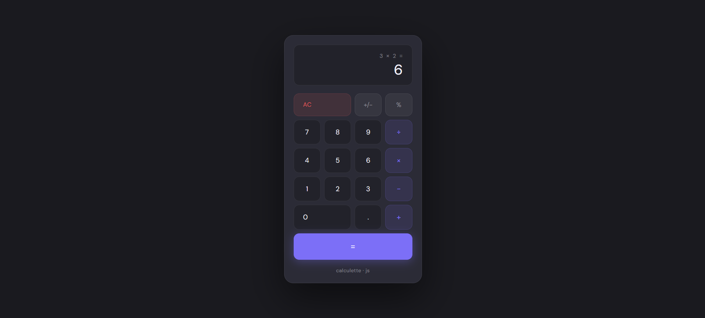

# 🧮 Js-cybercore — Calculette

Une calculette moderne construite en HTML, CSS et JavaScript vanilla, avec une interface sombre épurée et une expérience utilisateur soignée.
🔗 **[Tester la démo en direct](https://js-cybercore.onrender.com)**
---

## ✨ Fonctionnalités

- **Opérations de base** : addition, soustraction, multiplication, division
- **Fonctions utilitaires** : inversion de signe (`+/−`), pourcentage (`%`), remise à zéro (`AC`)
- **Affichage intelligent** : expression courante visible au-dessus du résultat, troncature automatique des grands nombres (précision, notation exponentielle)
- **Animation de résultat** : effet `pop` visuel à chaque calcul
- **Opérateur actif mis en évidence** visuellement
- **Support du clavier complet** :

| Touche | Action |
|---|---|
| `0–9` | Saisie des chiffres |
| `.` | Virgule décimale |
| `+` `-` `*` `/` | Opérateurs |
| `Enter` ou `=` | Calcul |
| `Backspace` | Effacement du dernier caractère |
| `Escape` | Remise à zéro |

---

## 🚀 Utilisation

Aucune dépendance, aucune installation requise. Ouvre simplement le fichier dans un navigateur :

```bash
# Cloner le repo
git clone https://github.com/Maxime288/Js-cybercore.git
cd Js-cybercore

# Ouvrir directement
open index.html
# ou glisser-déposer le fichier dans ton navigateur
```

---

## 🗂️ Structure

```
Js-cybercore/
├── index.html   # Application complète (HTML + CSS + JS en un seul fichier)
├── calculette.png
└── README.md
```

---

## 🎨 Stack technique

| Technologie | Rôle |
|---|---|
| HTML5 | Structure sémantique |
| CSS3 | Design, variables CSS, animations |
| JavaScript (ES6+) | Logique de calcul, gestion des événements |
| Google Fonts (`DM Sans`, `DM Mono`) | Typographie |

---

## 🖥️ Aperçu



Interface sombre avec palette violette (`#7c6ff7`), boutons différenciés par catégorie (chiffres, opérateurs, utilitaires), et écran à double ligne (expression + résultat).

---

## 📄 Licence

Ce projet est open-source — libre à toi de le forker et de l'adapter.
